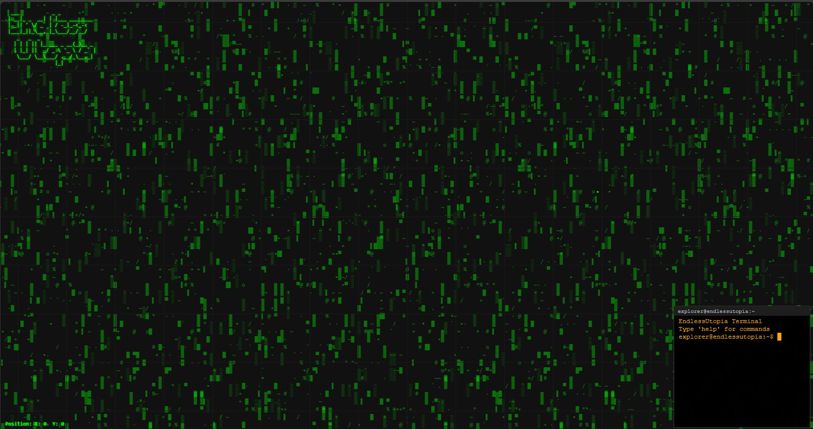

# EndlessUtopia



A procedurally generated, infinite ASCII world in your browser. Includes a draggable terminal with commands and a rare wandering Ascicat!

## Features

- Infinite world, rendered in ASCII
- Endless terminal (moveable, resizable, blinking prompt)
- Command system: help and look around
- Rare Ascicat (Easter Egg)
- Deterministic world generation

## Usage

- Use the terminal in the bottom right for commands
- Move with mouse/keyboard
- Try to find the Ascicat!

---

Made with Rust, WASM, and ❤️

## Overview

**EndlessUtopia** is an infinite, procedurally-generated ASCII world where each coordinate `(x, y)` produces deterministic patterns, glitches, or calm empty spaces. The world is endless, quiet, and mysterious, featuring a rare wandering ASCII Cat that appears only at special coordinates and leaves subtle traces.

## Requirements

- **Rust 1.70+**: For building the library
- **Terminal/Browser Support**: Best experienced with Unicode-capable terminals or browsers
  - Most modern terminals (iTerm2, Windows Terminal, GNOME Terminal) support the full character set
  - Fallback ASCII characters are used for core gameplay elements (cat = @, C, c, o, O)
  - Block characters (░▒▓█) used for visual effects may vary by environment

## Features

- 🌌 **Infinite World**: Truly endless coordinate-based generation
- 🎲 **Deterministic**: Same coordinates always produce the same result
- 🐱 **Wandering Cat**: Rare ASCII cat appears at special coordinates
- 👣 **Cat Traces**: Subtle marks left where the cat has been visited --> Todo
- 🎨 **Multiple Biomes**: Calm spaces, patterns, and glitch zones --> Todo
- ⚡ **Lightweight**: Optimized for Rust + WASM ASCII rendering
- 🎯 **No Dependencies**: Pure Rust implementation (except wasm-bindgen for WASM targets)

## World Biomes --> Todo

The world consists of several biome types:

- **Calm** (60%): Empty peaceful spaces with minimal decoration
- **Pattern** (25%): Various deterministic patterns including waves, checkerboards, stripes, and more
- **Glitch** (15%): Corrupted/glitchy areas with block characters
- **Cat Present**: Special coordinates where the wandering cat appears
- **Cat Trace**: Locations the cat has visited, marked with subtle dots

## Installation

Add to your `Cargo.toml`:

```toml
[dependencies]
endless_utopia = "0.1.0"
```

## Project Structure

```
EndlessUtopia/
├── src/
│   ├── lib.rs          # Entry point, module exports, WASM initialization
│   ├── world.rs        # Core world generator (World, Tile, Biome)
│   └── app.rs          # WASM application (Canvas, UI, event handling)
├── examples/
│   ├── explore.rs      # CLI tool for terminal exploration
│   └── cat_finder.rs   # CLI tool for finding cats
├── Makefile            # Build automation (build, serve, dev, clean)
├── app.html            # Minimal WASM loader (15 lines)
└── pkg/                # WASM build output (generated)
```

### Core Modules

#### **src/lib.rs**
- Main entry point for the library
- Exports `World`, `Tile`, and `Biome` structs
- Contains `#[wasm_bindgen(start)]` for automatic WASM initialization
- Initializes the `App` when running in browser

#### **src/world.rs**
- `World`: Coordinate-based infinite ASCII world generator
- `Tile`: Represents a single world tile (character, color, biome)
- `Biome`: Enum for world types (Calm, Pattern, Glitch, Cat, CatTrace)
- Deterministic generation using coordinate hashing
- Cat spawn logic and trace tracking
- Pattern generators (waves, checkerboard, stripes, etc.)

#### **src/app.rs**
- Complete WASM application running in browser
- Canvas creation and fullscreen management
- Event handling (mouse, keyboard, wheel, resize)
- Rendering pipeline:
  - ASCII world generation
  - Grid overlay
  - User drawings
  - Cat rendering with glow effect
  - UI elements (logo, position display, input fields)
- Pan/zoom controls
- Drawing mode

#### **examples/explore.rs**
CLI tool for terminal-based world exploration (native only, not WASM) --> todo ?

#### **examples/cat_finder.rs**
CLI tool for finding cat coordinates (native only, not WASM) --> todo ?

## Usage

### Coordinate Limits & Stability

- The `goto X Y` command in the terminal is limited to coordinates between -1,000,000 and +1,000,000 to prevent browser freezes and excessive resource usage. If you enter values outside this range, you will receive an error message and the app will remain stable.
- This fixes a previous bug ([Issue #4](https://github.com/Suncompute/EndlessUtopia/issues/4)) where extremely large coordinates could freeze the web interface.

### WASM Application (Browser)

Build and run the interactive web application:

```bash
# Build WASM module
make build

# Start development server
make serve

# Visit http://localhost:8000/app.html
```

**Controls:**
- **Left-click + Drag**: Draw on canvas
- **Space + Drag** / **Right-click + Drag**: Pan view
- **Arrow keys**: Move view
- **R**: Random location
- **C**: Find cat
- **Mouse wheel**: Zoom (future)

### Library Usage (Rust)

```rust
use endless_utopia::World;

fn main() {
    let mut world = World::new();
    
    // Get a single tile
    let tile = world.get_tile(0, 0);
    println!("Character at origin: {}", tile.character);
    
    // Render a region
    let region = world.render_region(0, 0, 40, 20);
    println!("{}", region);
    
    // Find cats nearby
    let cats = world.find_cat_nearby(0, 0, 100);
    for (x, y) in cats {
        println!("Found cat at ({}, {})", x, y);
    }
}
```

## Running Examples

Explore the infinite world:

```bash
cargo run --example explore
```

## Building

### WASM (Web Browser)

```bash
# Install dependencies
make install

# Build WASM module
make build

# Start development server on http://localhost:8000
make serve

# Development mode (auto-rebuild on changes)
make dev

# Clean build artifacts
make clean
```

### Native (CLI Examples)

```bash
# Run exploration tool
cargo run --example explore

# Run cat finder
cargo run --example cat_finder
```

## Performance

The generator is optimized for lightweight, real-time rendering:

- No heap allocations during tile generation
- Simple hash-based deterministic generation
- Optimized for size with `opt-level = "z"`
- Link-time optimization enabled for WASM builds

## The Wandering Cat

The ASCII cat is extremely rare and appears only at special coordinates determined by:
- Prime number-based hash matching
- Coordinate sum divisibility checks

TODO: When you visit a cat location, it leaves behind subtle traces (dots) that persist in your world instance, creating a unique exploration history.

Cat characters include: `@`, `C`, `c`, `o`, `O`

## Design Philosophy

EndlessUtopia follows these principles:

- **Minimal**: No unnecessary dependencies or complexity
- **Deterministic**: Exploration is reproducible and sharable via coordinates
- **Mysterious**: The world reveals itself gradually through exploration
- **Performant**: Suitable for real-time ASCII rendering in browsers

## License

This project is licensed under the MIT License - see the [LICENSE](LICENSE) file for details.

## Contributing

Contributions are welcome! Feel free to open issues or submit pull requests.

